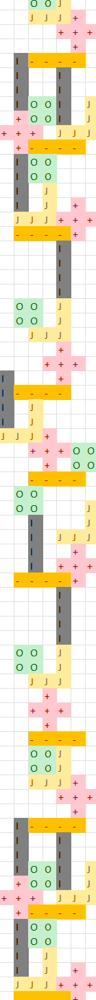

# Day 17

01:39:45   2539

16:49:38   7818

Am I still doing this? I missed a few days because I felt Excel wasn't really up to the challenge, and by extension, neither was i.
I probably could have done the maze one on Day 12, but I didn't really feel like doing a maze solver in Excel.
Eventually I should I can revisit/complete 2019.

So this time, I probably should have gone to bed, but... I already have a working custom-coded Tetris game in Excel with VBA (I should upload it here).
Considering this problem was a simplification of that (no rotation), I felt like I should go for it.

But, it took a while to debug the changes. The big delay was spawning in the correct location (with three blank rows).
It was irritating me because of the "plus" piece, when Excel determines the first row of a multi-area Range, it looks from the left, not from the top.
So, ended up using the [.CurrentRegion](https://learn.microsoft.com/en-us/office/vba/api/excel.range.currentregion) method of a Range to determine the row/height of the stack.

With a little bit of conditional formatting, you can see the sample input stack below, in a portion where you can visually see the repeat stacking pattern:

Preserving the piece names in the cells made it a lot easier to find a repeating pattern in my input for Part 2.
I used the CONCAT for each row, and looked for identical matches elsewhere in the stack. The furthest away matches were 2620 rows away.
By scanning through the output (piece number, row height), I was able to do the math for many more rocks than I could have waited to simulate.

By the way, Part 1 (or the example) took about 33 seconds to simulate on my laptop in Excel.
For part 2 I did about triple that height just to be sure I'd have enough to find a pattern.
